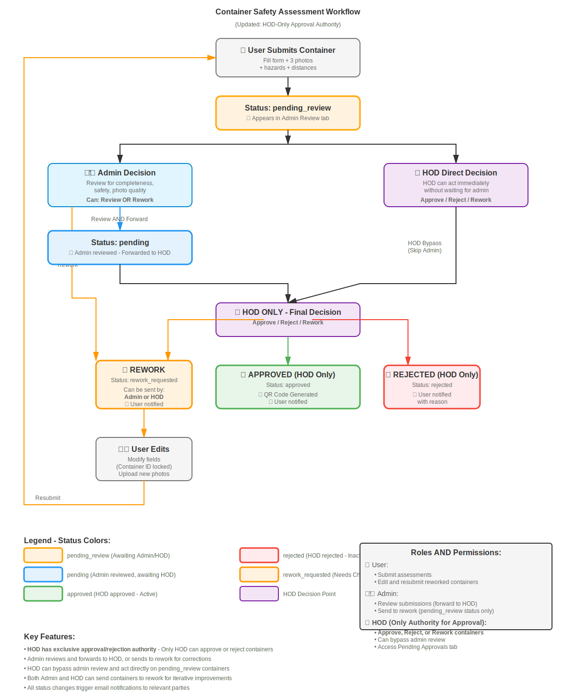
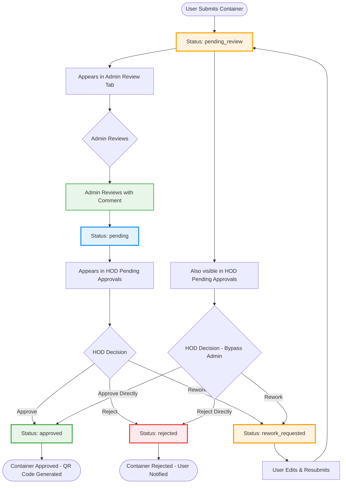

# Container Safety Assessment Workflow

This document describes the complete workflow for submitting, reviewing, and approving container safety assessments in the Kinross Chemical Compatibility Chart system.

## Overview

The system implements a multi-stage approval workflow with three main roles:
- **Users**: Submit container safety assessments
- **Admin**: Review submissions for completeness and safety
- **HOD (Head of Department)**: Final approval authority

## Visual Workflow Diagram

**[Click here to view full-size diagram](./workflow-diagram.svg)**

## Workflow Diagram (Mermaid)

## Workflow Diagram (Mermaid)

## Status Flow

### 1. User Submission
- **Action**: User fills out container assessment form with:
  - Container ID
  - Department and Location
  - WhatsApp contact number
  - Container Type (Bulk/Drum/IBC/etc.)
  - Selected hazard categories
  - Distance measurements between hazards
  - 3 mandatory attachments (front, inside, side photos)
- **Status**: `pending_review`
- **Visibility**:
  - Appears in **Admin Review** tab (Admins only)
  - Also visible in **Pending Approvals** tab (HOD only - can bypass admin review)
- **Notification**: Safety team receives email notification

### 2. Admin Review (Optional)
- **Action**: Admin reviews the submission for:
  - Completeness of information
  - Accuracy of hazard classifications
  - Quality of attached photos
  - Compliance with safety requirements
- **Admin has two options:**

  **Option A: Review & Forward to HOD**
  - Admin adds review comment (min 10 characters)
  - **Status Change**: `pending_review` → `pending`
  - **Visibility**: Moves to **Pending Approvals** tab for HOD
  - **Notification**: HOD receives email with admin's review comments
  - **Visual Indicator**: Container shows green border and admin review badge

  **Option B: Send to Rework**
  - Admin provides rework reason (min 10 characters)
  - **Status Change**: `pending_review` → `rework_requested`
  - **Notification**: User receives rework request email
  - User must edit and resubmit

### 3. HOD Approval (Final Authority)
HOD has three options:

#### Option A: Approve
- **Action**: HOD reviews and approves with comment (min 10 characters)
- **Status Change**: `pending_review` or `pending` → `approved`
- **Notification**: User receives approval email
- **Result**:
  - QR code generated for container
  - Container visible in user's assessments
  - Printable PDF available

#### Option B: Reject
- **Action**: HOD rejects with detailed reason (min 10 characters)
- **Status Change**: `pending_review` or `pending` → `rejected`
- **Notification**: User receives rejection email with reason
- **Result**: Container marked as rejected, no QR code

#### Option C: Rework
- **Action**: HOD requests changes with specific rework reason
- **Status Change**: `pending_review` or `pending` → `rework_requested`
- **Notification**: User receives rework request email
- **Result**:
  - Container appears in user's "My Assessments" with REWORKED badge
  - User can edit and resubmit
  - Rework count incremented
  - Container ID locked (cannot be changed)

### 4. HOD Bypass (Direct Approval)
- **Authority**: HOD can approve or reject containers in `pending_review` status
- **Purpose**: Allows HOD to bypass admin review when:
  - Time-sensitive approvals needed
  - HOD has sufficient expertise
  - Admin unavailable
- **Process**: Same as normal HOD approval, but skips admin review stage
- **Visual**: Container shows orange border (no admin review)

### 5. User Rework & Resubmit
- **Action**: User clicks "Edit & Resubmit" on reworked container
- **Editing**:
  - All fields editable except Container ID
  - Existing attachments preserved (can upload new ones)
  - Hazard selections and distances can be modified
- **Resubmission**:
  - Status changes back to `pending_review`
  - Rework fields cleared
  - Returns to admin review queue
  - Safety team notified of resubmission

## Status Definitions

| Status | Color | Description |
|--------|-------|-------------|
| `pending_review` | Orange | Awaiting admin review (or HOD bypass) |
| `pending` | Blue | Admin reviewed, awaiting HOD approval |
| `approved` | Green | HOD approved, container active |
| `rejected` | Red | HOD rejected, container inactive |
| `rework_requested` | Orange | Changes requested, awaiting user edit |
| `admin_reviewed` | Blue (legacy) | Admin reviewed (old status) |

## Visual Indicators

### In Pending Approvals Tab (HOD Only - Exclusive Access)

1. **Pending Review (Orange Border)**
   - Container hasn't been admin reviewed
   - HOD can approve directly (bypass)
   - Badge: "PENDING REVIEW"

2. **Admin Reviewed (Green Border)**
   - Container reviewed by admin
   - Shows admin reviewer name and comment
   - Badge: "PENDING APPROVAL"

3. **Regular Pending (Blue Border)**
   - Standard pending approval
   - Badge: "PENDING APPROVAL"

### Container Card Elements
- **Border Color**: Indicates review status
- **Status Badge**: Shows current status in header
- **Admin Review Section**: Green box with admin's comments (if reviewed)
- **Rework Badge**: Red badge if container has been reworked
- **Rework Count**: Shows number of times reworked

## Notifications

### Email Notifications Sent:
1. **User Submits** → Safety Team
2. **Admin Reviews** → HOD
3. **HOD Approves** → User
4. **HOD Rejects** → User
5. **HOD Requests Rework** → User
6. **User Resubmits** → Safety Team

## Permissions

| Action | User | Admin | HOD |
|--------|------|-------|-----|
| Submit Container | ✓ | ✓ | ✓ |
| View Own Assessments | ✓ | ✓ | ✓ |
| Admin Review (Forward to HOD) | ✗ | ✓ | ✗ |
| **Approve/Reject** | ✗ | **✗** | **✓ (Only)** |
| Request Rework | ✗ | ✓ (pending_review only) | ✓ (pending_review or pending) |
| Edit Reworked Container | ✓ (own) | ✗ | ✗ |
| View All Containers | ✗ | ✓ | ✓ |
| View Pending Approvals Tab | ✗ | ✗ | ✓ (Only) |
| Delete Container | ✗ | ✓ | ✓ |

**Key Permissions:**
- **Only HOD** can approve or reject containers
- **Only HOD** has access to the "Pending Approvals" tab
- Admin can review and forward to HOD, or send to rework
- HOD can bypass admin review and approve directly

## Best Practices

### For Users:
- Provide complete and accurate information
- Upload clear, well-lit photos (front, inside, side)
- Double-check hazard classifications
- Ensure distance measurements are accurate
- Respond promptly to rework requests

### For Admins:
- Review all mandatory fields are completed
- Verify hazard classifications are appropriate
- Check photo quality and clarity
- Provide detailed, constructive comments
- Review within 24 hours of submission

### For HOD:
- Review admin comments when available
- Provide clear, detailed approval/rejection reasons
- Use rework feature for fixable issues (don't reject immediately)
- Consider using bypass only when necessary
- Maintain approval/rejection consistency

## Technical Notes

- Container IDs are auto-generated and immutable after submission
- Attachments are mandatory (all 3 photos required)
- Comments must be minimum 10 characters
- Status transitions are logged with timestamps
- Email notifications are asynchronous (non-blocking)
- Rework count tracks iteration history
- QR codes link to container detail view

## Troubleshooting

### Container stuck in pending_review
- **Cause**: No admin or HOD action taken
- **Solution**: Admin should review, or HOD can bypass

### Cannot edit container
- **Cause**: Container not in rework_requested status
- **Solution**: HOD must first request rework

### Attachments not showing in edit mode
- **Cause**: Attachments not properly loaded
- **Solution**: Check backend logs, verify file paths

### Email notifications not received
- **Cause**: SMTP configuration or email address issue
- **Solution**: Verify SMTP settings and user email in database

---

**Last Updated**: 2025-10-26
**Version**: 1.0
**System**: Kinross Chemical Compatibility Chart Web Application
